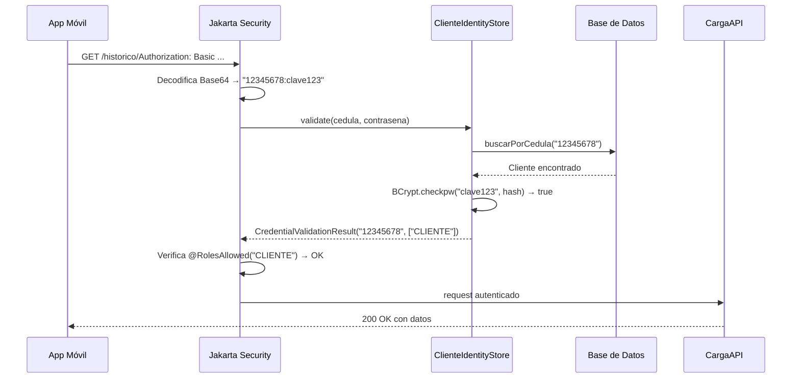
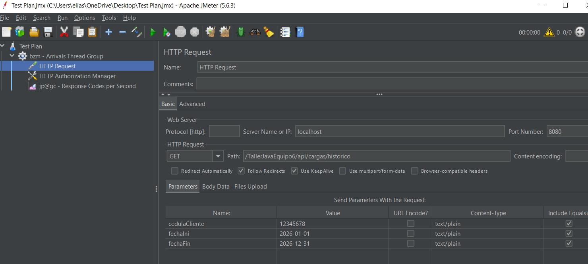

## Iteración 2 — Seguridad

Se protegió la API REST de la App Móvil con autenticación, autorización y un límite de consultas en el endpoint de histórico.


### Qué se hizo

Se agregó seguridad a los endpoints que usa la App Móvil. Para poder usarlos, el cliente tiene que identificarse con su cédula y contraseña. Además, se puso un límite de consultas en el endpoint de histórico para que no se pueda abusar de él.

---

### Cómo funciona el login — Basic Auth

Cuando la App Móvil hace una consulta, manda en el encabezado del request la cédula y contraseña del cliente en formato codificado (Base64):

Algo asi: 
```
Authorization: Basic MTIzNDU2N....
```

Lo que viaja codificado es simplemente `cedula:contraseña`. WildFly y jakarta Security decodifican eso y llama al `ClienteIdentityStore`, que busca al cliente en la base de datos y verifica la contraseña usando BCrypt.

#### Diagrama — qué pasa cuando se hace una consulta



Si la cédula o contraseña son incorrectas, el servidor responde **401 Unauthorized** sin llegar al endpoint.

---

### Qué endpoints requieren login

Por defecto, todos los endpoints están bloqueados (`@DenyAll` en la clase). Cada método declara explícitamente si es público o requiere login.

| Endpoint | Acceso | Quién lo usa |
|----------|--------|-------|
| `POST /api/clientes/registrar` | Público | Cualquiera |
| `GET /api/clientes` | Público | Gestor Web |
| `POST /api/cargas/estaciones` | Público | Gestor Web |
| `GET /api/cargas/estaciones` | Público | Gestor Web |
| `POST /api/cargas/cargadores` | Público | Gestor Web |
| `POST /api/clientes/{cedula}/medioPago` | Requiere login | App Móvil |
| `POST /api/clientes/{cedula}/reclamos` | Requiere login | App Móvil |
| `POST /api/cargas/iniciar` | Requiere login | App Móvil |
| `POST /api/cargas/finalizar` | Requiere login | App Móvil |
| `GET /api/cargas/activa` | Requiere login | App Móvil |
| `GET /api/cargas/historico` | Requiere login + límite de consultas | App Móvil |
| `GET /api/pagos/{cedula}/listarPagos` | Requiere login | App Móvil |

---

### Verificación de que cada cliente solo accede a sus propios datos

No alcanza con verificar que el cliente esté logueado. También se verifica que solo pueda operar sobre sus propios datos. Si el cliente `12345678` intenta consultar o modificar datos del cliente `111111`, el servidor le responde **403 Forbidden**.

| Código | Qué significa |
|--------|-------------|
| `401 Unauthorized` | No se identificó o la contraseña es incorrecta |
| `403 Forbidden` | Está logueado pero está intentando acceder a datos de otro cliente u otro rol |

---

### Límite de consultas en `/historico`

El endpoint de histórico genera mucha carga en la base de datos, por eso se le puso un límite usando el algoritmo **Token Bucket** (balde de tokens):

```
Balde con 10 tokens al arrancar
├── Cada consulta consume 1 token
├── Si no hay tokens → 429 Too Many Requests
└── Se agregan 5 tokens por segundo
```

En la práctica el sistema deja pasar hasta 5 consultas por segundo de forma continua. Las primeras 10 pasan todas gracias a los tokens iniciales del balde.

#### Cómo se configuró la prueba en JMeter

**Arrivals Thread Group** — define cuántos requests por segundo manda JMeter:


| Parámetro | Valor | Qué significa |
|-----------|-------|-------------|
| Target Rate | 15 | 15 consultas por segundo |
| Ramp Up Time | 5 seg | Tarda 5 segundos en llegar a las 15 consultas/seg |
| Hold Target Rate Time | 30 seg | Mantiene esa carga durante 30 segundos |

**HTTP Request** — define a qué endpoint apunta cada consulta:



Apunta a `GET /TallerJavaEquipo6/api/cargas/historico` en `localhost:8080` con los parámetros `cedulaCliente=12345678`, `fechaIni=2026-01-01` y `fechaFin=2026-12-31`.

**HTTP Authorization Manager** — agrega las credenciales a cada consulta automáticamente:


Configura `username=12345678` y `password=clave123` para `http://localhost:8080`. JMeter las codifica en Base64 y las manda en el header `Authorization: Basic ...` de cada consulta, simulando exactamente lo que haría la App Móvil.

#### Resultado — gráfica Response Codes per Second


- **Línea roja (200):** consultas que llegaron al servidor y fueron respondidas — había lugar en el balde. Al principio la línea arranca más alta porque el balde empieza lleno con 10 tokens. Una vez que se gastan esos tokens iniciales, se estabiliza en 5 por segundo, que es cuántos tokens se agregan por segundo.
- **Línea azul (429):** consultas bloqueadas — el balde estaba vacío.

La relación entre la configuración y el resultado de la grafica: JMeter manda 15 consultas por segundo, el límite deja pasar 5 (los que se recargan por segundo) y bloquea 10. Por eso rojo + azul = 15 en cada segundo — lo que cambia es cuántas pasan y cuántas son bloqueadas dependiendo de cuántos tokens haya en el balde en ese momento.

---

### Pruebas con curl

#### 1. Endpoints públicos — sin credenciales

```bash
# Registrar cliente
curl -X POST http://localhost:8080/TallerJavaEquipo6/api/clientes/registrar -H "Content-Type: application/json" -d "{\"cedula\":\"12345678\",\"nombreCompleto\":\"Juan Perez\",\"telefono\":\"099123456\",\"contrasena\":\"clave123\",\"tipo\":\"COMUN\"}"

# Ver clientes (verificar que se registró)
curl http://localhost:8080/TallerJavaEquipo6/api/clientes

# Crear estacion
curl -X POST http://localhost:8080/TallerJavaEquipo6/api/cargas/estaciones -H "Content-Type: application/json" -d "{\"descripcion\":\"Estacion Centro\",\"calle\":\"18 de Julio\",\"departamento\":\"Montevideo\",\"longitud\":-34,\"latitud\":-56}"

# Ver estaciones (verificar)
curl http://localhost:8080/TallerJavaEquipo6/api/cargas/estaciones

# Crear cargador
curl -X POST http://localhost:8080/TallerJavaEquipo6/api/cargas/cargadores -H "Content-Type: application/json" -d "{\"idEstacion\":1,\"tipo\":\"RAPIDO\",\"tieneCable\":true,\"tipoConector\":\"TIPO2\",\"potenciaMinima\":22}"
```

#### 2. Endpoints protegidos sin credenciales — deben dar 401

```bash
# Medio de pago sin credenciales
curl -X POST http://localhost:8080/TallerJavaEquipo6/api/clientes/12345678/medioPago -H "Content-Type: application/json" -d "{\"tipo\":\"TARJETA\",\"numero\":\"1234567890123456\",\"tipoTarjeta\":\"VISA\",\"fechaVencimiento\":\"2027-12-01\"}"

# Reclamo sin credenciales
curl -X POST http://localhost:8080/TallerJavaEquipo6/api/clientes/12345678/reclamos -H "Content-Type: application/json" -d "{\"comentario\":\"El cargador no funciona\"}"

# Iniciar carga sin credenciales
curl -X POST http://localhost:8080/TallerJavaEquipo6/api/cargas/iniciar -H "Content-Type: application/json" -d "{\"cedulaCliente\":\"12345678\",\"idCargador\":1,\"idMedioPago\":1}"

# Finalizar carga sin credenciales
curl -X POST http://localhost:8080/TallerJavaEquipo6/api/cargas/finalizar -H "Content-Type: application/json" -d "{\"idCargador\":1,\"consumoKwh\":15.5,\"minutosDemora\":0}"

# Carga activa sin credenciales
curl "http://localhost:8080/TallerJavaEquipo6/api/cargas/activa?cedulaCliente=12345678"

# Historico sin credenciales
curl "http://localhost:8080/TallerJavaEquipo6/api/cargas/historico?cedulaCliente=12345678&fechaIni=2026-01-01&fechaFin=2026-12-31"

# Listar pagos sin credenciales
curl "http://localhost:8080/TallerJavaEquipo6/api/pagos/12345678/listarPagos?fechaIni=2026-01-01&fechaFin=2026-12-31"
```

#### 3. Flujo normal con credenciales correctas

```bash
# Agregar medio de pago
curl --user 12345678:clave123 -X POST http://localhost:8080/TallerJavaEquipo6/api/clientes/12345678/medioPago -H "Content-Type: application/json" -d "{\"tipo\":\"TARJETA\",\"numero\":\"1234567890123456\",\"tipoTarjeta\":\"VISA\",\"fechaVencimiento\":\"2027-12-01\"}"

# Hacer un reclamo
curl --user 12345678:clave123 -X POST http://localhost:8080/TallerJavaEquipo6/api/clientes/12345678/reclamos -H "Content-Type: application/json" -d "{\"comentario\":\"El cargador no funciona\"}"

# Iniciar carga
curl --user 12345678:clave123 -X POST http://localhost:8080/TallerJavaEquipo6/api/cargas/iniciar -H "Content-Type: application/json" -d "{\"cedulaCliente\":\"12345678\",\"idCargador\":1,\"idMedioPago\":1}"

# Ver carga activa (verificar que esta iniciada)
curl --user 12345678:clave123 "http://localhost:8080/TallerJavaEquipo6/api/cargas/activa?cedulaCliente=12345678"

# Finalizar carga
curl --user 12345678:clave123 -X POST http://localhost:8080/TallerJavaEquipo6/api/cargas/finalizar -H "Content-Type: application/json" -d "{\"idCargador\":1,\"consumoKwh\":15.5,\"minutosDemora\":0}"
```

#### 4. Verificación de acceso a datos propios — debe dar 403

```bash
# Cliente 12345678 intenta operar sobre datos de otro cliente
curl --user 12345678:clave123 -X POST http://localhost:8080/TallerJavaEquipo6/api/clientes/111111/medioPago -H "Content-Type: application/json" -d "{\"tipo\":\"TARJETA\",\"numero\":\"1234567890123456\",\"tipoTarjeta\":\"VISA\",\"fechaVencimiento\":\"2027-12-01\"}"
```

#### 5. Escenario A — Pago aprobado (requiere ServicioMedioPagoMock corriendo)

Los primeros 5 pagos siempre se aprueban.

```bash
# Iniciar carga
curl --user 12345678:clave123 -X POST http://localhost:8080/TallerJavaEquipo6/api/cargas/iniciar -H "Content-Type: application/json" -d "{\"cedulaCliente\":\"12345678\",\"idCargador\":1,\"idMedioPago\":1}"

# Finalizar carga — pago COMPLETADO, cliente no queda bloqueado
curl --user 12345678:clave123 -X POST http://localhost:8080/TallerJavaEquipo6/api/cargas/finalizar -H "Content-Type: application/json" -d "{\"idCargador\":1,\"consumoKwh\":15.5,\"minutosDemora\":0}"

# Verificar que puede iniciar otra carga
curl --user 12345678:clave123 -X POST http://localhost:8080/TallerJavaEquipo6/api/cargas/iniciar -H "Content-Type: application/json" -d "{\"cedulaCliente\":\"12345678\",\"idCargador\":1,\"idMedioPago\":1}"

# Finalizar para dejar el cargador libre
curl --user 12345678:clave123 -X POST http://localhost:8080/TallerJavaEquipo6/api/cargas/finalizar -H "Content-Type: application/json" -d "{\"idCargador\":1,\"consumoKwh\":10.0,\"minutosDemora\":0}"
```

#### 6. Escenario B — Pago rechazado (requiere ServicioMedioPagoMock corriendo)

El mock aprueba los primeros 5 pagos y rechaza el 6to. Ejecutar este comando 5 veces para llegar al rechazo:

```bash
# Ciclos 2, 3, 4, 5 y 6 — ejecutar 5 veces
curl --user 12345678:clave123 -X POST http://localhost:8080/TallerJavaEquipo6/api/cargas/iniciar -H "Content-Type: application/json" -d "{\"cedulaCliente\":\"12345678\",\"idCargador\":1,\"idMedioPago\":1}" && curl --user 12345678:clave123 -X POST http://localhost:8080/TallerJavaEquipo6/api/cargas/finalizar -H "Content-Type: application/json" -d "{\"idCargador\":1,\"consumoKwh\":15.5,\"minutosDemora\":0}"
```

En el 6to ciclo el pago queda RECHAZADO y el cliente queda bloqueado.

```bash
# Verificar que quedo bloqueado — responde que tiene deuda pendiente
curl --user 12345678:clave123 -X POST http://localhost:8080/TallerJavaEquipo6/api/cargas/iniciar -H "Content-Type: application/json" -d "{\"cedulaCliente\":\"12345678\",\"idCargador\":1,\"idMedioPago\":1}"
```

#### 7. Verificaciones finales

```bash
# Ver historico completo de cargas
curl --user 12345678:clave123 "http://localhost:8080/TallerJavaEquipo6/api/cargas/historico?cedulaCliente=12345678&fechaIni=2026-01-01&fechaFin=2026-12-31"

# Ver todos los pagos — aparecen COMPLETADO y RECHAZADO segun los escenarios ejecutados
curl --user 12345678:clave123 "http://localhost:8080/TallerJavaEquipo6/api/pagos/12345678/listarPagos?fechaIni=2026-01-01&fechaFin=2026-12-31"
```
